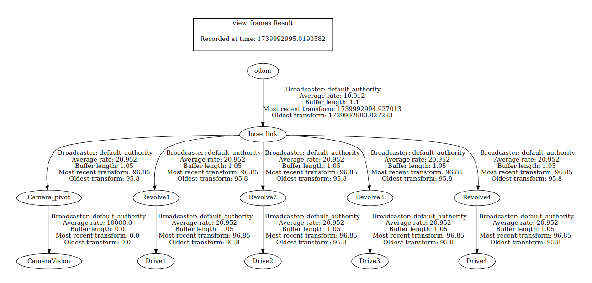

# ROS RIGOR: Reducing Compute Strain for running ROS on Low-Power Devices


__The following is a living document to show the timeline, goals, and progress of the "ROS Rigor" research project__


# Goal 1: Design a Robot to Utilize

**Note** this robot is the result of work I did in my undergrad, with all parts being bought by me. I will happily share the design files, but the physical robot will remain with me.


# Goal 2: Create a Dev Environment

## Conclusion

The following will create a Ros2 Jammy, Ubuntu Noble, Gazebo Harmonic image for you to use

```
cd local_env
docker compose up -d
```

# Goal 3: Run the Gazebo/Rviz Environment


## Notes:

Launching RVIZ to play with the robot

```
colcon build
source install/setup.bash
xhost +local:docker
ros2 pkg list | grep hermes
ros2 launch urdf_tutorial display.launch.py model:=/Robots/hermes_robot/urdf/hermes_robot.urdf
```

Launching Gazebo to see the robot

https://gazebosim.org/docs/harmonic/spawn_urdf/

gz sim empty.sdf

gz service -s /world/empty/create --reqtype gz.msgs.EntityFactory --reptype gz.msgs.Boolean --timeout 1000 --req 'sdf_filename: "/Robots/hermes_robot/urdf/hermes_robot_2.urdf", name: "urdf_model"'

ros2 launch ros_gz_sim gz_sim.launch.py gz_args:=empty.sdf


cd /opt/ros/jazzy/share

root@6ff27fb03f10:/Robots/hermes_robot/launch# ros2 launch gazebo.launch.py 

https://github.com/gazebosim/ros_gz/blob/ros2/ros_gz_bridge/launch/ros_gz_bridge.launch.py

ros2 run ros_gz_bridge parameter_bridge --ros-args -p config_file:=ScanConfig.yaml 

## Conclusion

The following can be run, and will share the RVIZ and Gazebo windows outside of your container for viewing

```
xhost +local:docker
docker exec -it ros2 bash
cd /Robots/hermes_robot
colcon build
source install/setup.bash
cd launch
ros2 launch gazebo.launch.py 
```

# Goal 4: Link Gazebo and RVIZ

## Notes:

Currently running into issues with the ros_gz_bridge not persisting the joint_states across the gz and ros environments.

https://discordapp.com/channels/1077825543698927656/1303391211435851899


AH! Gazebo needs to be the ground source of truth for physics, and RVIZ used as just a visulaizer
https://github.com/gazebosim/ros_gz_project_template/blob/main/ros_gz_example_bringup/launch/rrbot_setup.launch.py

https://github.com/freshrobotics/swerve-sim-container

https://www.freshconsulting.com/insights/blog/how-to-build-a-swerve-drive-robot/

https://github.com/ros/ros_tutorials/tree/jazzy/turtlesim

ros2 launch robot.launch.py

https://gazebosim.org/docs/harmonic/moving_robot/

https://gazebosim.org/api/sim/8/tutorials.html

https://github.com/gazebosim/gz-sim/tree/gz-sim8/examples/plugin

https://github.com/gazebosim/gz-sim/tree/gz-sim8/examples/plugin/command_actor

# Goal 5: Create a Simulated Gazebo Environment

gz topic -l

- Publish to a topic:

gz topic -e -t /drive/4/command

ros2 topic pub /swerve_a/rqst_pivot_angle std_msgs/msg/Float64 "{data: 0}"

# Goal 5.5: Simulate the Sensors

Going back to some of my previous work, how do I convert urdf to sdf and such? Seems Gazebo uses sdf, and robot_state_publisher uses urdf

I think Gazebo has an adapter:

```
cd hermes_robot_description/urdf && gz sdf -p hermes.urdf > hermes2.sdf
```

## Difference between URDF and SDF

### URDF (Unified Robot Description Format)

- **Purpose**: Primarily used in ROS (Robot Operating System) to describe the physical configuration of a robot.
- **Format**: XML-based.
- **Capabilities**: Defines the kinematic and dynamic properties of the robot, including joints, links, and sensors.
- **Limitations**: Limited support for advanced simulation features like friction, contact properties, and complex sensor configurations.

### SDF (Simulation Description Format)

- **Purpose**: Used in Gazebo for detailed simulation of robots and environments.
- **Format**: XML-based.
- **Capabilities**: Provides extensive support for simulation features, including friction, contact properties, light sources, and complex sensor configurations.
- **Advantages**: More comprehensive for simulation purposes, allowing for detailed environmental and physical interactions.

### Conversion
- **URDF to SDF**: Gazebo provides tools to convert URDF files to SDF for simulation purposes.
    ```
    cd hermes_robot_description/urdf && gz sdf -p hermes.urdf > hermes.sdf
    ```

In summary, URDF is simpler and used for robot description in ROS, while SDF is more detailed and used for simulation in Gazebo.

https://www.youtube.com/watch?v=tzN0QT1id0M

http://gazebosim.org/docs/latest/migrating_gazebo_classic_ros2_packages/

[text](https://gazebosim.org/api/sim/9/classgz_1_1sim_1_1systems_1_1JointPositionController.html)

https://github.com/lgrvanlieshout/gazebo_camera_example

Validate the sdf:

```
gz sdf -k your_model.sdf

```

# Goal 6: Write basic Robot Control Code, which is just NAV2 Integration

To start, I'm going to deploy the Turtlebot sim with Nav2 and see what I can learn about it's structure to add to my own. I suspect this will take some time, I'll detail my findings below:

## My TF structure

<div style="background-color: white;">
    
</div>

## Their TF structure

<div style="background-color: white;">
    
</div>

How do I get map/odom? Do I have to do it within the robot code?

```
ros2 run tf2_tools view_frames
```



Composition for embedded

https://docs.wpilib.org/en/stable/docs/software/kinematics-and-odometry/swerve-drive-kinematics.html

https://github.com/issaiass/realsense2_description

https://www.youtube.com/watch?v=mJILStNnYyU

https://gazebosim.org/docs/latest/migrating_gazebo_classic_ros2_packages/

https://github.com/gazebosim/gz-harmonic

https://www.youtube.com/watch?v=T9xZ22i9-Ys

https://gazebosim.org/docs/latest/migrating_gazebo_classic_ros2_packages/

ros2 run rqt_tf_tree rqt_tf_tree

https://github.com/jyang-cpr/husky-sphinx-tutorials/blob/1e4a13c9e30689f5ec28002c1f812da136907379/doc/additional_sim_worlds.rst#L228


https://github.com/search?q=repo%3Agazebosim%2Fgz-sim%20%3Csensor&type=code

gz topic -i -t /lidar/points

---

Why not Ionic for Gazebo?

because it's not compatible with Jazzy:

https://gazebosim.org/docs/all/ros_installation/

---

https://github.com/turtlebot/turtlebot4

https://github.com/ros-navigation/navigation2/blob/main/nav2_bringup/launch/tb3_simulation_launch.py

https://github.com/ros-navigation/nav2_minimal_turtlebot_simulation/blob/main/nav2_minimal_tb3_sim/urdf/gz_waffle_gps.sdf.xacro#L167

https://github.com/ros-navigation/nav2_minimal_turtlebot_simulation/blob/main/nav2_minimal_tb3_sim/launch/spawn_tb3.launch.py

https://github.com/ros-navigation/nav2_minimal_turtlebot_simulation/blob/main/nav2_minimal_tb3_sim/urdf/gz_waffle.sdf.xacro

**Clean XACRO layout**
https://github.com/turtlebot/turtlebot4/tree/jazzy/turtlebot4_description

RGBD:
https://github.com/turtlebot/turtlebot4/blob/jazzy/turtlebot4_description/urdf/sensors/oakd.urdf.xacro

https://index.ros.org/p/slam_toolbox/#jazzy

Example this is based on:

ros2 launch nav2_bringup tb3_simulation_launch.py headless:=False

https://docs.nav2.org/setup_guides/transformation/setup_transforms.html

ros2 launch hermes_robot all.launch.py world_file_name:=dynamic.sdf

# Goal 9: Compile Data from Testing to Come to a Conclusion

/opt/ros/jazzy/opt/gz_msgs_vendor/lib/python/gz/msgs10

# Goal 10: Write Thesis
