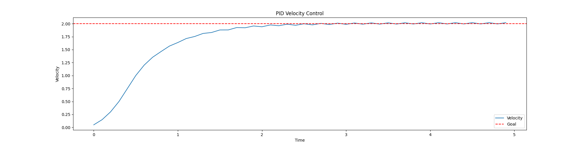
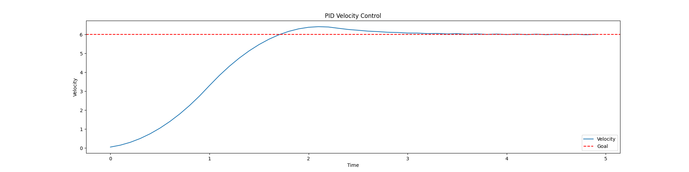
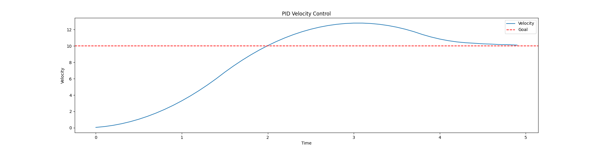

# Methods and Results

## Introduction

This section details the methods used to develop the swerve drive robot in ROS2, including the development of the robot model, the implementation of the slam_toolbox and Nav2 stack, and the testing of the robot in simulation. The section is divided into several subsections, each detailing a specific aspect of the development process. The process unfolds chronologically as the researcher experienced them. Many of these steps, especially when divided on the typical hardware/software line, can be run in parallel. To better help your understanding, an anycdote is applied to each minor section on the division. Note that all source code and models are available on the GitHub repository for this project; the link is provided in the appendix. As this work is ongoing, attached to the Github link is a specific commit hash. You may use this to check out the code at the time of this writing.

## Development of the Model

_Prodomidently hardware_

To develop the model, one software solution stood above the rest: Solidworks. Its toolchain, though a plugin, let's you export to URDF, which is the standard for ROS2. The model was developed with the following considerations in mind:

- The frames of the robot must have the following hierarchy:
    - base_frame
        - base_link
            - WheelPivotA
                - WheelDriveA
            - WheelPivotB
                - WheelDriveB
            - WheelPivotC
                - WheelDriveC
            - WheelPivotD
                - WheelDriveD
            - camera_pivot
                - camera_link
            - IMU Link

- The X Axis is the most crucial axis to align: for Nav2, **the X axis of the base_link must be aligned with the forward motion of the robot**. This is the default for the URDF exporter, so it is important to ensure that the model is aligned with the X axis in Solidworks.
- For the pivots to function appropriately, the pivot axis must be aligned on their Z axis. Otherwise you risk improper or lopsided movement of the modules

When developing the model, the best approach is the design the model in full, developing submodules where available. Following this, you can proceed with adding points and reference axis. Remember, for the sake of simplified axis, try and keep all your axis aligned with one another. This will make it easier to export to URDF, and easier to debug later. Since this is foundational to the structure of the robot, and changing it will require work, it is best to get this right the first time.


Butler Lampson, one of the first scientists to envision the modern personal computer in 1972 once said that "All problems in computer science can be solved by another level of indirection". However, it is the belief of this researcher that humans opperate along the inverse of this principle. As such, while there are other tools better adapted to generate launch files for robot descriptions (in this case the generated URDF) for specifically ROS2, adding another tooling into the production process is uneccsary by leveraging the URDF export plugin for Solidworks. 

## Exporting The Artifacts of the URDF, and its Common Structures

_Predominantly hardware_

Upon exporting the URDF, you will find the following file structure:


Note that this structure is consistent with standard description files for ROS1. However.

When preparing the URDF, there are a few considerations to make. First and foremost, the key framework you are setting up is a link/joint relationship. Links are coordinated through joints, with links typically having some form of mesh or solid that is rendered. This relationship is seen in figure X:


Within the visual, note that the link and joint, despite being closely related, do not share the same name. This is important, as the URDF will compile incorrectly if the names are the same. The joint and link should operate in a parent/child relationship. Additionally, note that Solidworks has also added the mass and inertia tags. Learned from expereince, the Gazebo physics engine is particular about these values being calculated correctly. As was a consequence in simulation, you will find the robot may flip over or behave irreadically if you attempt to edit these values manually.

## Adapting the model to be URDF Compliant: Understanding the URDF File

_Both Hardware and Software_

Despite the above warning, it should be noted that massless links and plugins do not produce a problem for the physics engine when added into the URDF. For keen eyes, you will notice that there is no native way within this export tool to define the necessary Gazebo plugins to allow for the robot to be controlled. This is a critical step, as the robot will not be able to be controlled without these plugins, nor will you be able to simulate the sensor data.


As an additional post-processing step, you will need to add your sensors and controllers to the URDF. This is done through the use of the gazebo tags. The following is an example of the camera sensor:


Finally, once you have prepared this, change the file extension name to .urdf.xacro. This is critical because, on launch, this file is converted to both and URDF and an SDF so that both ROS and Gazebo can consume the proper data for rendering and simulation.

## Writing a Launch File to "Spawn" the model in Gazebo

_Predominantly software_

The approach used within this paper deviates from the typical Gazebo workflow by seperating out the world URDF from the robot URDF. In this way, we can leverage one xacro file that can be converted to both SDF and URDF, without having complicate it by wrapping it in world-file-related tags. This is done by adapting the launch file to start Gazebo, generate a world, then spawn in the robot at a given Cartesian coordinate. This paper also introduces a different approach to how the ROS2 launch files are written. Favoring a more modular approach, the launch file is broken down into smaller components, each with a specific purpose and each written in their own seperate laucnh file. Upon wanting to bring up a sequence of services, you can either run each launch file individually, or run the main launch file that will bring up all the services in the correct order. This is a more modular approach, and allows for easier debugging and testing of the robot. In accordance with this, this paper has a "world" launch file (world.launch.py) and a "robot" launch file (robot.launch.py). You can also bring up all the services by leveraging the main launch file (all.launch.py).

## Writing a World file for the Robot to Navigate in Gazebo

_Predominantly software_

The world file is a critical component to validating the sensors on a robot. It is the first baseline you will use to determine if your algorithms are accurate. In the same way the AI community is experiencing the "Garbage in Garbage out" problem, the robotics community is experiencing the same. If your world file is inconsistent with the problems you are facing, then it is worthless to your robotics development. As such, at the outset of this project, an initial world was developed to test the robot it. It consisted of a room with two obstacles, with an additional small room that was meant to act as a hallway. This worked great for initial testing. However, as the project progressed, it was noted that points within the laser scan were drifing. Initially, this was assumed to be related to the SLAM, as there were very few features within the simple room to latch onto. Upon this discovery, the world file was updated with a example from the community: a factor floor, with obstacles to avoid, to better match the use case and environment for the robot. However, even upon changing the world, the drift of the points and subsequent high-error on the maps led to the discovery that the odom calculation was incorrect, which resulted in an incorrect TF transform from the base_link to the odom frame. This was corrected, and the robot was able to navigate the world with a high degree of accuracy.

Note below the first world leveraged compared to the updated world:


## Architecture of the ROS Nodes

_Predominantly software_

Most standard ROS controller nodes for robots reflect the work accomplished for the standard "differential drive" robot controller, simulating a swerve drive robot. This work is contained in (MAR3) and is continually evolving. In the past, these were written in C to provide speed. I believe this is the correct course of action, as it maintains a focus on runtime speed, something critical in robotics. However, for readibility and for this paper to function as a first draft for a full swerve drive controller, teh reasercher has opted to use Python. 

Unlike the traditional differential drive robot, the swerve drive robot has four independently driven, each of which can rotate on a radial axis. This requires a unique controller node to manage the movement of the robot. The controller node is responsible for taking in the velocity commands from the user, and converting them into the appropriate wheel velocities through a kinematic model. This model describes the relationship between the wheel velocities and the robot's linear and angular velocities, deriving most of its corpus from the formula for circular motion to define wheel speeds and angles. Upon recieving a command, in the standard convention of the /cmd_vel topic, the controller node will publish commands to the swerve drive modules, which are themselves ROS nodes. In an attempt to keep the code base clean, the modules run seperate computations for PID controls. This is done to ensure that the controller node is not bogged down with computations, and can focus on the primary task of converting the velocity commands into wheel velocities. Additionally, since they are broken out as seperate components, each node has its own health topics, which can be monitored by the controller node. This allows for easier debugging and maintenance of the robot, especially when it is in the field.

Additionally, when considering your inputs, the goal of this research was to integrate the NAV2 software stack. A critical observation to be made about the topic publication is that NAV2 has a default /nav_cmd_vel topic, which publishes an X heading velocity and an angular twist velocity for the z axis. However, since this robot can move in any direction, the controller node must convert this data into the appropriate wheel velocities. This is done by leveraging the Pythagorian Therom, converting the single X magnitude into an X and Y component (with the original X acting as the hypothenuse). This is then converted into the appropriate wheel velocities. This is a critical step, as it allows the robot to move in any direction, and not just along the X axis, while maintaining the capabilities of NAV2. The angular velocity is perpetuated forward, and does not need a conversion. The diagram below illustrates how ROS manages this conversion amongst the controller nodes.

Also understand that the code running the computation above is housed in a seperate node for easy re-use. This is a staple of this research, as code or infrastructure that cannot be reused or recycled is a waste of resources, and does not actively contribute to the community. You can see the utilization of this node in the graph provided below:

<!-- An image of the nodes -->


Furthermore, when considering ease of use and understanding of the robot, a typical control through the keyboard arrow keys or WASD felt insufficient. As such, a webapp was created to help visualize the commanded wheel angles and velocities through a visual representation of the robot. It also includes a slider element to command linear and angular velocities. This is a critical step, as it allows for the user to understand the robot's movement in a more intuitive way, and allows for easier debugging of the robot's movement.

<!-- Placeholder image for the UI -->


This controller, however, presented its own set of challenges. Accepting both user input and nav messages meant a topic that was being published to by two seperate nodes. To solve this, the twist_mux node, a standard node within the ROS ecosystem, was deployed and configured to manage the topics by prioritizing and consolidating them to a common topic that the robot can ingest. That flow is show in the diagram below:


## Writing an Odom Node for the Swerve Drive Module

The odometry is based on a combination of data pulled from the kinematics of the model as well as the sensor data pulled from the onboard IMU. On the physical robot proposed by this paper, there would be two such IMU: one independent IMU, and the additional IMU data pulled from the camera module. In this way, there is redundancy of the sensor suit as is convention within modern robotics. However, for the simulation, we only consider the single IMU positioned at the center of the robot. This is briefly shown in the previous discussion of TF frames. Its data is leveraged to determine the angular position of the robot, which is then used to compute the wheel angles and velocities. The positional change of the wheels based on this is used to determine the linear position of the robot within the world. It should be noted that this structure leaves the odometry system vulnerable to drift if the wheels slip. This is combatted by the map to odom transform, which helps maintain the robot's position within the world through SLAM. 


_Note that I indend to change this math image to be more formal instead of a photo of my notebook, and to go into a deeper explanation of the math_

**EXPLINATION GOES HERE**

For a more concrete example, the research team has created an online simulation to illustrate the movement of the robot. This simulation is available at the following link: [https://www.forsythcreations.com/swerve_drive](https://www.forsythcreations.com/swerve_drive). 


Note that, within this simulation, you can view a practical example of wheel angles, headings, basic TF transforms, as well as historic data of the wheel positons as a sanity check to ensure the robot is moving as expected.

## Writing a PID Controller for the Swerve Drive Module

_Predominantly software_

As stated previously, the control system architecture attempts to keep smart software solutions in mind. One major consideration made within this design was how to better accomidate a flexible software set that is light weight enough to be deployed on a Raspberry Pi or other such device. This consideration is critical for the PID tuning, which has been added within each of the swerve_module nodes. 

PID Tuning is an acronym for Proportional, Integral, and Derivative. It is a control loop feedback mechanism that is used to control the output of a system. The PID controller calculates an error value as the difference between a desired setpoint and a measured process variable. The controller attempts to minimize the error by adjusting the process control inputs. The PID controller algorithm involves three separate constant parameters: the proportional, the integral, and the derivative values. The proportional value determines the reaction to the current error, the integral value determines the reaction based on the sum of recent errors, and the derivative value determines the reaction based on the rate at which the error has been changing. The weighted sum of these three actions is used to adjust the process via a control element such as the position of a control valve or the power supply of a heating element. 

For our purposes, each wheel is tuned based on the torque specification of the motor, and the moment of intertia of the wheel. Three tuning methods were attempted for this robot system: a standard Zieger-Nichols tuning method, a manual tuning method that tries all possible values within a range, and a gradient decent method used to optimize not only the parameters themselves, but make the calcualtion faster. The outputs of the PID controller tuning are shown below. It should be noted that, unless otherwise stated, the goal of each of these tuning simulations is to take an object from 0 m/s to 5 m/s as fast as possible, minimizing overshoot, minimizing oscillation, and minimizing the time it takes to reach the desired speed while running the computation as efficiently as possible.

To accomplish this tuning, the researcher used a simulation of the swerve drive robot. This simulation was run in Python, accepting a max_torque, moment of inertia, a desired speed, an acceleration dampener (since we assume the robot is not a perfect system), and an ideal convergence time. This convergence time will be critical when we discuss the gradient decent PID tuner, further down in this paper. The simulation runs a simple Euler integration loop, where the torque is applied to the wheel, and the wheel accelerates based on the torque and moment of inertia. The simulation runs until the wheel reaches the desired speed, or until the maximum time is reached. The simulation also records the time it takes to reach the desired speed, as well as the overshoot and oscillation of the wheel speed. This data is then used to tune the PID controller. 

As such, the following constants were applied in simulation. These values were selected based on the specifications of the motors, as well as the moment of inertia of the wheels:

accel_damping: 0.5
moment_of_inertia: 0.4
max_torque: 3.75
time_frame: 10
dt: 0.1

### Zieger-Nichols Tuning

Using (MAR4), the Zieger-Nichols tuning method was applied to the swerve drive modules. The results of this tuning are shown below:

| Controller | P | I | D |
|--------|---|---|---|
| PID      | 0.6 * Ku | 2 / Tu | Tu / 8 |


Notice how the Zieger model does eventually reach a steady state. However, it continues to oscillate, and does not reach the desired speed in a timely manner. This is a common problem with the Zieger-Nichols tuning method, as it is not designed for systems with high inertia or systems that require fast response times. As such, this method was not used for the final tuning of the PID controller. This paper, and the tuning methods therein, is seeking a reliable, fast, and accurate tuning method that can be used in a variety of situations. The Zieger-Nichols method is not suitable for this purpose, as it does not provide the necessary accuracy or speed.

### Manual Tuning

So instead, the researcher attempted to manually tune the PID controller. This was done by iterating through a range of values for each of the PID parameters, and selecting the combination that provided the best performance. The results of this tuning are shown below. The following are the ranges that were used for the tuning:

```python
kp_range = np.linspace(0.01, 200, 30)  # Adjust range as needed
ki_range = np.linspace(0.01, 200, 30)
kd_range = np.linspace(0.01, 200, 30)
```

This yielded what is known as a "brute force" tuning method. The results of this tuning are shown below, and is used as a ground source of truth as we compare it to other methods:


Notice, however, that there are a few issues with this method. First, the computation alone is very slow, as it iterates through a large number of combinations. For this range of values, the program took two minutes to execute. This is not suitable for a tuning method, as it is not fast enough to be used in a real-time system. This method, running on discrete changes to the P, I, and D values has another problem: inability to effectively process out the remaining oscillations. As you can see, the oscillations persist as the graph proceeds to the fixed point. This is a common problem with manual tuning methods, as they are not designed to handle systems with high inertia or systems that require fast response times. As such, this method was not used for the final tuning of the PID controller. Instead, the researcher attempted to use a gradient decent method to tune the PID controller. Note that, for this method, the convergence time (calculated by taking an average of five executions and determining if it was settling out to a value) was two seconds. The importance of this will be discussed in the next section. Also, for the sake of completeness, the following are the values that were used for the tuning:

```python
kp = 27.59
ki = 0.01
kd = 13.802
overshoot = 0.02
oscilations_within_timeframe = 20
```

Note that we calculate oscilations by determining any peaks of valleys that deviate beyond a threshold of 0.02 from the goal.

Where Ku is the ultimate gain, and Tu is the ultimate period. The ultimate gain is the value of the proportional gain that causes the system to oscillate, and the ultimate period is the time it takes for the system to complete one oscillation. These values were determined by running a series of tests on the system, and observing the response of the system to different values of the proportional gain. The ultimate gain and period are critical values in the Zieger-Nichols tuning method, as they are used to calculate the PID parameters. However, they are not suitable for systems with high inertia or systems that require fast response times.

### Gradient Decent Tuning

The gradient decent method is a more advanced tuning method that uses a mathematical optimization technique to find the optimal values for the PID parameters. This method is based on the idea of minimizing the error between the desired output and the actual output of the system. The gradient decent method works by iteratively adjusting the PID parameters in the direction of the steepest descent of the error function. This is done by calculating the gradient of the error function with respect to each of the PID parameters, and adjusting the parameters in the opposite direction of the gradient. Moreover, when defining our gradient cost function, we can selectivly choose the parameters we want to optimize. This is a critical step, as it helps us better define how we want the gradient decent to behave given slow response time, high amounts of oscilation, and high settling time. The results of this tuning are shown below:


This method converged within two seconds, consistent with the brute force method above. Additionally, the oscillations are reduced to zero. To further validate this, researchers used the same PID parameters to try and govern the motion across multiple goal states. The following are the results:

**Goal: Move from 0 to 2 m/s**



**Goal: Move from 0 to 4 m/s**


**Goal: Move from 0 to 6 m/s**



**Goal: Move from 0 to 8 m/s**


**Goal: Move from 0 to 10 m/s**




Note the following results for these tests:

| **Goal (m/s)**  | **Time to Converge (s)** | **Overshoot (m/s)** | **Oscillations** | **Error** |  **Tuning Values (P, I, D)** |
|-----------------|--------------------------|---------------------|------------------|-----------|------------------------------|
| 2               | 1.9                      | 0.02                | 10               |  13.83    |      (1.54, 0, 0.0373)       |
| 4               | 1.8                      | 0.05                | 8                |  32.16    |      (1.54, 0, 0.0373)       |  
| 6               | 3.2                      | 0.41                | 18               |  61.97    |      (1.54, 0, 0.0373)       |
| 8               | 4.7                      | 1.8                 | 20               |  112.79   |      (1.54, 0, 0.0373)       |
| 10              | 5.1                      | 2.80                | 18               |  167.78   |      (1.54, 0, 0.0373)       |

With this data, we notice the trend of increasing overshoot and oscillations as the goal increases. As the error is, in part, a side effect of these metrics and not normalized, we include it in the table for completeness but will not consider it for this discussion. Changing parameters in this manor is a common problem with PID controllers, as they are not designed to handle a large range of change without considerations being made for the gain. The datapoint for the 10 m/s is especially troubling, as this overshoot is far beyond standard error. To reduce error, the researcher thought to use reinforcement learning. However, since this work is bounded to low-level hardware, and most reinforcement learning algorithms are designed to run with CUDA or other such technologies, the decision was made to discretize and multi-train the PID controller. This was accomplished by designing a class that takes a parameter for the range you expect the robot to operate in. It will then train subtle variations of the PID controller, gaining the PID values for each variation. These are stored in a dictionary that can be accessed in O(1) time or, in the worst case, a 0(n) time complexity, making it ideal for real-time applications. This class is as follows:

```python
class MultiPID:
    def __init__(self, difference, step = 1):
        self.difference = difference
        self.step = step
        self.tunings = {}

    def train(self):
        for i in range(1, self.difference, self.step):
            # Train a model based on the spec, using i as the goal
            print(f"Training for goal {i}")
            pid = NewPID(intertia=moment_of_inertia, max_torque=max_torque, logging=True, accel_damping=accel_damping, ideal_convergence_time = 1)
            pid.reset()
            params = pid.auto_tune_gradient_descent(i, max_iter=200, max_time = time_frame, learning_rate=200, auto_accept=True, tolerance = 0.001)
            self.tunings[i] = params

    def get(self, current, goal):
        # Get the PID values for the goal
        int_difference = int(abs(current - goal))
        tuning = self.tunings.get(int_difference, None)
        if tuning is None:
            # Find the closest tuning
            closest = min(self.tunings.keys(), key=lambda x:abs(x-int_difference))
            print(f"Using closest tuning for goal {goal}: {closest}")
            tuning = self.tunings.get(closest)
        return tuning

multi = MultiPID(15)
multi.train()
```

Note that, in cases where the exact discrete case isn't available, the closest tuning is used. Also note that, to reduce complexity at run time, it is assumed that a movement from 4.5 to 4.8 m/s, or from 3.3 to 3.5 m/s are identical based on the difference being on average 0.25. The algorithm will simply return the lowest PID values from the dictionary. The results of this multi-PID approach are shown below:

**Goal: Move from 0 to 2 m/s**


**Goal: Move from 0 to 4 m/s**


**Goal: Move from 0 to 6 m/s**


**Goal: Move from 0 to 8 m/s**


**Goal: Move from 0 to 10 m/s**


Note the following results for these tests:

| **Goal (m/s)**  | **Time to Converge (s)** | **Overshoot (m/s)** | **Oscillations** | **Error** |  **Tuning Values (P, I, D)** |
|-----------------|--------------------------|---------------------|------------------|-----------|------------------------------|
| 2               | 1.2                      | 0.01                | 1                |  10.71    |       (1.2, 0, 0.0)          |
| 4               | 1.8                      | 0.02                | 4                |  31.82    |       (0.812, 0, 0.0)        |
| 6               | 2.2                      | 0.05                | 11               |  60.10    |      (41.72, 0, 23.006)      |
| 8               | 2.5                      | 0.10                | 15               |  93.52    |      (0.608, 0, 0.0)         |
| 10              | 3.3                      | 0.00                | 0                |  133.9    |  (27899.53, 0 , 19422.90 )   |

Notice that, in every case comparing the single PID tune to the multi-tune, the overshoot and oscillations improved and converged faster. This is consistent with typical control systems. Typically, convergence is a function of an aggressive P term. However, aggression must increase with variance in difference from *current* to *goal*. A single tune will not be able to accomidate such variance. However, this discrete multi-tune method has proven highly effective for this task. It resembles the harmonic tuning commonly used in robotics, especially on Bambu Labs 3D printers.


## Deploying a Webpage to Control the Robot

_Predominantly software_


## Deploying Nav2 and Slam Toolbox

_Predominantly software_


## Validating the Swerve Drive Robot in Gazebo

_Predominantly software_


## Saving a Map for Later Validation

_Predominantly software_


---

# Links

https://wiki.ros.org/sw_urdf_exporter (ROS1 URDF Exporter)

https://www2.dmst.aueb.gr/dds/pubs/inbook/beautiful_code/html/Spi07g.html#:~:text=All%20problems%20in%20computer%20science,envisioned%20the%20modern%20personal%20computer. (Butler Lampson Quote)

(MAR3) https://github.com/ros-controls/ros2_controllers

(MAR4) https://ieeexplore.ieee.org/document/6147128

