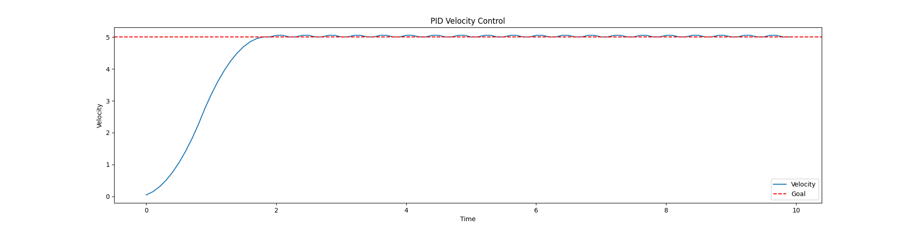
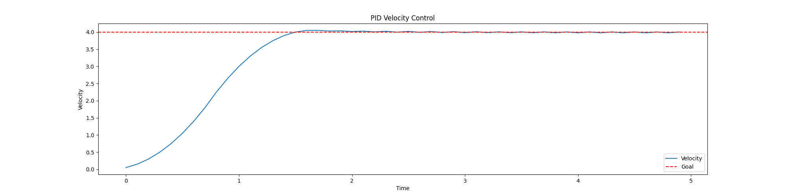
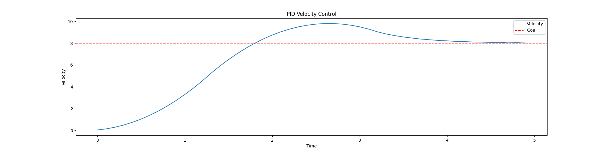
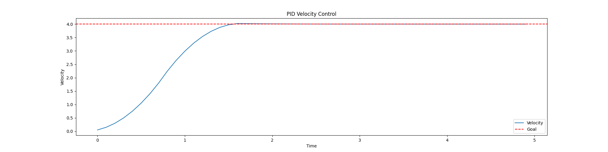
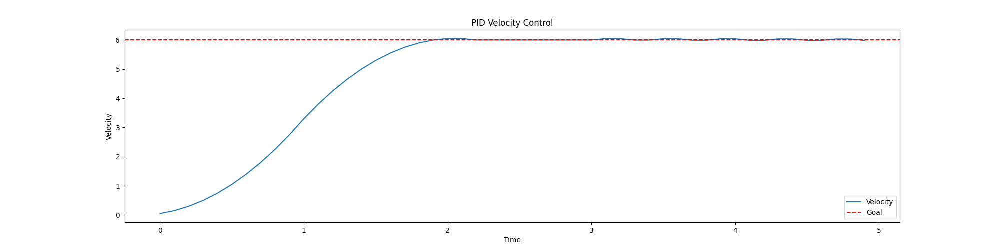
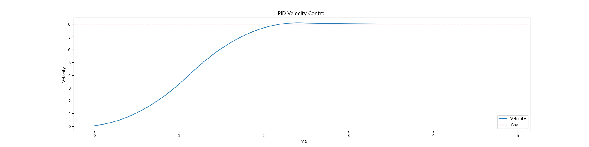

# Results

## Introduction

This section details the methods and results of the developed swerve drive robot in ROS2, including the development of the robot model, the implementation of the slam_toolbox and Nav2 stack, and the testing of the robot in simulation. The section is divided into several subsections, each detailing a specific aspect of the development process. The process steps unfolds chronologically as the researcher experienced them. Many of these steps, especially when divided on the typical hardware/software line, can be run in parallel when, either academically or commercially, split amongst a team. To serve this purpose, an anycdote is applied to each minor section on the division. Note that all source code and models are available on the GitHub repository for this project; the link is provided in the appendix. As this work is ongoing, attached to the Github link in the apendix is a specific commit hash. This hash corresponds to the time this paper was written and is what you should reference in the event that the repository changes.

## Addressing the Research Questions

In this section you will find a chronological breakdown of the research questions, and how they were addressed. To permit a better organization of how the questions are addressed, the following breakout is consistent with the research questions:

- How can we use ROS2 and Gazebo to simulate and validate our swerve drive robot?
    - This is covered in the section "Validating the Swerve Drive Robot in Gazebo"
- How can we configure Nav2 for the most computational headroom without increasing error?
    - This is covered in the section "Validating Deployment on a Raspberry Pi 5: Checking Computational Headroom"
- What perception systems are best suited for swerve drive robots? What are the trade-offs between different perception systems?
    - This is covered in the section "Deploying Nav2 and Slam Toolbox, With Validation"
- If its measurable its manageable. What are key performance metrics for swerve drive robots?
    - This is covered in the section "Developing a Swerve Drive Module Using a Swerve Differential"

## Developing a Swerve Drive Module Using a Swerve Differential

At the outset of this section, understand that there is a series of robots known as "differential drive" robots. These robots are designed with two wheels, and their motion is derived from a "differential" of the two wheels. This is a common design, and is used in many robots today. The swerve drive module I propose operates using a difference, also known as a differential, between two pulleys, relying on the encoders in the motors and a homing limit switch to determine the position of the wheels. The use of the word "differential" in these two cases is problematic, even though its usage is appropriate. As such, when discussing the swerve drive module, I will refer to it as a "swerve differential" to avoid confusion.

This swerve differential allows you to avoid slip rings for motors and encoders on the drive axis, which simplifies the electrical complexity. Introducing this swerve differential does require the use of bevel gears to modify the orientation of the motor shaft to the wheel shaft. See the below diagram for how this is accomplished:


In developing this module, we now have an intuition for which solid bodies should operate as a link, and which should operate as a joint. This will be critical as we move into the URDF development.

It is also important to note what we are "validating" and what the acceptance criteria are. The acceptance criteria for the swerve drive module is as follows:
- Keep Raspberry Pi 5 computational headroom in mind, below 70% utilization on a full bench test. 50% utilization is ideal when communicating with limited peripherals (a limited bench setup where the Raspberry Pi does not have access to motor controllers, encoders, or other peripherals)
- The robot must not deviate from its commanded goal pose beyond 0.1 m
- The robot's control scheme must not move when module error is above 0.1 rads
- The less overshoot in a module, the less resultant error/time lost to convergence. Minimize convergence time and oscillations, preferably below two seconds and any oscilations with an amplitude above 0.1 radian deviation from the goal should be seen as non-compliant.

## Deployment Strategy

The heart of this research revolves around an understanding of both hardware and software, and how to implement a scalable, easy to maintain system. While the former has already been discussed, the deployment strategy for the latter still warrants acknowledgement. ROS is, traditionally, tightly tied to a particular Ubuntu distribution. To simplify the deployment process, the researcher has opted to use Docker containers to deploy the ROS2 system. This allows for a more modular approach, where one container can run all the components, or each component of the system can be deployed in its own container. This is especially useful for the Nav2 stack, as it allows for easy scaling and deployment of the system. This research uses a single-container deployment, but is written to allow for multi deployment with the same built image.


## Development of the URDF Model

_Prodomidently hardware_

Butler Lampson, one of the first scientists to envision the modern personal computer in 1972 once said that "All problems in computer science can be solved by another level of indirection" [19]. However, it is the belief of this researcher that humans opperate along the inverse of this principle, where many layers of indirection result in confusion. As such, while there are other tools better adapted to generate launch files for robot descriptions (in this case the generated URDF) for specifically ROS2, adding another tooling into the production process is unneccsary. We will instead directly leverage a Solidworks plugin [18] that generates a URDF given that you provide it with which solid bodies make up a link, and which reference frames define that joint's motion. More on the importance of proper link and joint structures will be provided later in the paper. By electing to use the plugin, we keep all our frame definitions and axis in one place, and allows us to leverage the existing tooling for ROS2. The model was developed with the following considerations in mind:

- The frames of the robot must have the following hierarchy, based on Nav2 requirements:
    - base_frame
        - base_link
            - WheelPivotA
                - WheelDriveA
            - WheelPivotB
                - WheelDriveB
            - WheelPivotC
                - WheelDriveC
            - WheelPivotD
                - WheelDriveD
            - camera_pivot
                - camera_link
            - IMU Link
- The X Axis is the most crucial axis to align: for Nav2, **the X axis of the base_link must be aligned with the forward motion of the robot**. This is the default for the URDF exporter, so it is important to ensure that the model is aligned with the X axis in Solidworks.
- For the pivots to function appropriately, the pivot axis must be aligned on their Z axis. Otherwise you risk improper or lopsided movement of the modules
- The robot must have a means of perception, such that it can navigate the world. This is accomplished through the use of a camera and IMU. The camera is mounted on a pivot, which allows it to rotate and look in any direction. The IMU is mounted on the base_link, and provides data on the robot's orientation and acceleration. It is important to note that the physical bodies of the sensors are available at this stage, but the sensor definitions that Gazebo leverages are added later in the process.

When developing the model, the best approach is the design the model in full, developing submodules and repeated parts where available. Following this, you can proceed with adding points and reference axis. Remember, for the sake of simplified axis, choose a common axis convention. For the sake of this paper, our translational axis is always the X axis, whereas rotational is typically the Y or Z axis. This will make it easier to export to URDF, and easier to debug later. Since this is foundational to the structure of the robot, and changing it will require work, it is best to get this right the first time. Below is an example a reference frame used in the model. Note the perserved convention:


Within this example, we added a point where we expected the reference frame to be, then added a reference frame to that point. The Solidworks plugin can do this automatically, but strictly defining your axis was helpful for debugging. Below is a snapshot of the Solidworks Feature Design Tree typically on the left handside of the software that shows the reference frames and points:


Once there are defined, you can export the URDF. This is done by selecting the "Export to URDF" option in the Solidworks plugin. This will generate a URDF file, as well as a set of meshes and textures that are used to render the robot in Gazebo. An example of the export plugin is shown below:


## Exporting The Artifacts of the URDF, and its Common Structures

_Predominantly hardware_

Upon exporting the URDF, you will find the following file structure:


This structure is consistent with standard description files for ROS1. However, the launch files are not directly compatible with ROS2. This is a current known shortcoming of the export tool. Even so, the work around is simple and will be discussed later in this paper.

When preparing the URDF, there are a few considerations to make. First and foremost, the key framework you are setting up is a link/joint relationship. Links are coordinated through joints, with links typically having some form of mesh or solid that is rendered. This relationship is seen in figure X:


Within the visual, note that the link and joint, despite being closely related, do not share the same name. This is important, as the URDF will compile incorrectly if the names are the same. The joint and link should operate in a parent/child relationship. Additionally, note that Solidworks has also added the mass and inertia tags. Learned from expereince, the Gazebo physics engine is particular about these values being calculated correctly. As was a consequence in simulation, you will find the robot may flip over or behave irreadically if you attempt to edit these values manually without considerations being made for the physics engine.


## Adapting the model to be URDF Compliant: Understanding the URDF File

_Both Hardware and Software_

Despite the above warning, it should be noted that massless links and plugins do not produce a problem for the physics engine when added into the URDF. For keen eyes, you will notice that there is no native way within this export tool to define the necessary Gazebo plugins to allow for the robot to be controlled. The robot will not be able to be controlled without these plugins, nor will you be able to simulate the sensor data.

As an additional post-processing step, you will need to add your sensors and controllers to the URDF. This is done through the use of the gazebo tags. The following is an example of the camera sensor:


Finally, once you have prepared this, change the file extension name to .urdf.xacro. This is critical because, on launch, this file is converted to both and URDF and an SDF so that both ROS and Gazebo can consume the proper data for rendering and simulation. Upon starting the system, the URDF file will be published to the /robot_description topic, resulting in the following TF frames:


## Writing a Launch File to "Spawn" the model in Gazebo

_Predominantly software_

The approach used within this paper deviates from the typical Gazebo workflow by seperating out the world URDF from the robot URDF. In this way, we can leverage one xacro file that can be converted to both SDF and URDF, without having complicate it by wrapping it in world-file-related tags. This is done by adapting the launch file to start Gazebo, generate a world, then spawn in the robot at a given Cartesian coordinate. This also allows you to vary the world specifications, then simply spawn the robot. This paper also utilizes a methodized approach to how the ROS2 launch files are written. Favoring a more modular approach, the typical launch file is broken down into smaller sub-launchers, each with a specific purpose and each written in their own seperate launch file. Upon wanting to bring up a sequence of services, you can either run each sub-launch file individually, or run the main launch file that will bring up all the services in the correct order. This is a more modular approach, and allows for easier debugging and testing of the robot. In accordance with this, this paper has a "world" launch file (world.launch.py) and a "robot" launch file (robot.launch.py). You can also bring up all the services by leveraging the main launch file (all.launch.py). A segment of the robot launch file is shown below:

```python
def generate_launch_description():
    pkg_hermes_robot_description = get_package_share_directory('hermes_robot_description')
    
    # Convert hte corrected.urdf.xacro file to a urdf file
    xacro_path = os.path.join(pkg_hermes_robot_description, 'urdf', 'corrected2.urdf.xacro')
    
    # Convert the xacro file to a urdf file
    result = subprocess.run(['xacro', xacro_path], capture_output=True, text=True)
    urdf_xml = result.stdout
    
    # Save the urdf to a file to look at later
    urdf_path = os.path.join(pkg_hermes_robot_description, 'urdf', 'corrected.urdf')
    with open(urdf_path, 'w') as outfp:
        outfp.write(urdf_xml)
```


## Writing a World file for the Robot to Navigate in Gazebo

_Predominantly software_

The world file is a critical component to validating the sensors on a robot. It is the first baseline you will use to determine if your algorithms are accurate. If the world does not reflect your actual operating conditions, you will experience the same "garbage in garbage out" data processing issue the AI community and many others are struggling with. This mistake occured when we began with a simple, unrealistic world file. It consisted of a room with two obstacles, with an additional small room that was meant to act as a hallway. This worked great for initial testing. However, as the project progressed, it was noted that points within the laser scan were drifing. Initially, this was assumed to be related to the SLAM, as there were very few features within the simple room to latch onto. Working on this assumption, the world file was updated with a example from the community: a factory floor, with obstacles to avoid, to better match the use case and environment for the robot. You see, since swerve drive robots can move laterally, moving heavy objects without rotating then on a factory floor would be ideal for this robotic system, especially if used in swarm for larger applications. However, even upon changing the world, the drift of the points and subsequent high-error on the maps led to the discovery that the odom calculation was incorrect, which resulted in an incorrect TF transform from the base_link to the odom frame. This was corrected, but the point drift is important to note as a result of this miscalculation. An example of the the point drift that occurs when the odometry or any other parent TF is shown below. Note the improved alignment of the pointcloud:

**Drifting Laserscan**


**Corrected Odometry Leading to Corrected Laserscan**


## Architecture of the ROS Nodes

_Predominantly software_

Most standard ROS controller nodes for robots reflect the work accomplished for the standard "differential drive" robot controller, simulating a swerve drive robot. This work is contained in [20] and is continually evolving. Normally, these were written in C to provide runtime speed [20]. I believe this is the correct course of action, as it maintains a focus on runtime speed, something critical in robotics. However, for readibility and for this paper to function as a first draft for a full swerve drive controller, the reasercher has opted to use Python. 

Unlike the traditional differential drive robot, the swerve drive robot has four independently driven, each of which can rotate on a radial axis. This requires a unique controller node to manage the movement of the robot. The controller node is responsible for taking in the velocity commands from the user, and converting them into the appropriate wheel velocities through a kinematic model. This model describes the relationship between the wheel velocities and the robot's linear and angular velocities, deriving most of its corpus from the formula for circular motion to define wheel speeds and angles. Upon recieving a command, in the standard convention of the /cmd_vel topic, the controller node will publish commands to the swerve drive modules, which are themselves ROS nodes. In an attempt to keep the code base clean, the modules run seperate computations for PID controls. This is done to ensure that the controller node is not bogged down with computations, and can focus on the primary task of converting the velocity commands into wheel velocities. Additionally, since they are broken out as seperate components, each node has its own error topics, which can be monitored by the controller node. This allows for easier debugging and maintenance of the robot, especially when it is in the deployed for use.

<!-- Do I need an example of the topics/nodes here? Wouldn't hurt -->


Additionally, when considering your inputs, the goal of this research was to integrate the NAV2 software stack. A critical observation to be made about the topic publication is that NAV2 has a default /nav_cmd_vel topic, which publishes an X heading velocity and an angular twist velocity for the z axis. This can be adapted by changing the holonomic configuration within Nav2. For our purposes, to ensure both crab drive and traditional drive is supported, a converstion node was developed to make the robot move in a traditional style. This is done by leveraging the Pythagorian Therom, converting the single X magnitude into an X and Y component (with the original X acting as the hypothenuse). This is then converted into the appropriate wheel velocities. The angular velocity is perpetuated forward, and does not need a conversion. The diagram below illustrates how ROS manages this conversion amongst the controller nodes, taking a /cmd_vel_nav and using the /converter_node to convert it to a /new_cmd_vel_nav topic which the /twist_mux node can consume.


Furthermore, when considering ease of use and understanding of the robot, a typical control through the keyboard arrow keys or WASD felt insufficient. As such, a webapp was created to help visualize the commanded wheel angles and velocities through a visual representation of the robot. It also includes a slider element to command linear and angular velocities. This is a critical step, as it allows for the user to understand the robot's movement in a more intuitive way, and allows for easier debugging of the robot's movement.

<!-- Placeholder image for the UI -->


This controller, however, presented its own set of challenges. Accepting both user input and nav messages meant a topic that was being published to by two seperate nodes. To solve this, the twist_mux node, a standard node within the ROS ecosystem, was deployed and configured to manage the topics by prioritizing and consolidating them to a common topic that the robot can ingest. The twist mux can be seen in Figure X.

## Writing an Odom Node for the Swerve Drive Module

The odometry is based on a combination of data pulled from the kinematics of the model as well as the sensor data pulled from the onboard IMU. Odometry is used to compute a positon for the robot relative to its starting position. It is the then the responsibility of the mapping algorithm to compute the error, and supply a transform that better stations the robot in the physical world. This is useful in the event of wheel slip, IMU drift, or calibration error. Odometry is typically solved through a combination of GPS, IMU, Optical Flow, or other sensors. On the physical robot proposed by this paper, there would be two such IMU: one independent IMU, as well as the additional IMU data pulled from the camera module. In this way, there is redundancy of the sensor suit as is convention within modern robotics. However, for the simulation, we only consider the single IMU positioned at the center of the robot. This is briefly shown in the previous discussion of TF frames. Its data is leveraged to determine the angular position of the robot, which is then used to compute the wheel angles and velocities. The positional change of the wheels based on this is used to determine the linear position of the robot within the world. 

The following computation is used to determine the wheel angles and velocities given a pair of linear velocities (X and Y) as well as an angular velocity about the Z axis (W). 


$$
V_{\text{ith caster}} = V_{\text{robot}} + \omega_{\text{robot}} \cdot O
$$

*From here on, "robot" will be anything with subscript r, "caster linear velocity" will be subscript c, and "offests" will be O. They will follow such that "ao" would represent the wheel offset of module A, "at" would represent the tire velocity of wheel A, "r" would refer to the robot as a whole, and r as a constant represents the radius of the wheel. Note that, in this convention, "caster" is being used instead of "wheel" to avoid any confusion between angular velocity ω and the single letter w. The word "tire" was also considered, but that presented a conflict with t, or time*

$$
\begin{bmatrix}
V_{\text{xc}}  \\
V_{\text{yc}}  \\
0 
\end{bmatrix} = 
\begin{bmatrix}
V_{\text{xr}}  \\
V_{\text{yr}}  \\
0
\end{bmatrix} +
\begin{bmatrix}
0 \\
0 \\
\omega_{\text{r}}
\end{bmatrix} \cdot
\begin{bmatrix}
O_{\text{xc}} \\
O_{\text{yc}} \\
0
\end{bmatrix}
$$

Which implies that:

$$
\begin{aligned}
V_{\text{xc}} &= V_{\text{xr}} + \omega_{\text{r}} \cdot O_{\text{xc}} \\
V_{\text{yc}} &= V_{\text{yr}} + \omega_{\text{r}} \cdot O_{\text{yc}}
\end{aligned}
$$

We can the define the magnitude of the wheel velocity as:

$$
V_{\text{t}} = \sqrt{V_{\text{xc}}^2 + V_{\text{yc}}^2}
$$

Which, expanding the above equations, gives us:


**#1**
$$
V_{\text{t}} = \sqrt{(V_{\text{xr}} + \omega_{\text{r}} \cdot O_{\text{xc}})^2 + (V_{\text{yr}} + \omega_{\text{r}} \cdot O_{\text{yc}})^2}
$$

Finally, we can derive the formula for the wheel angle as:

**#2**
$$
\theta_{\text{t}} = \arctan\left(\frac{V_{\text{xr}} + \omega_{\text{r}} \cdot O_{\text{xc}}}{V_{\text{yr}} + \omega_{\text{r}} \cdot O_{\text{yc}}}\right)
$$

Which means, to keep track of our position over time given these formulas, we can use the following equations:

$$
x_{\text{r}} = x_{\text{r}} + V_{\text{xr}} \cdot t + \frac{1}{2} \cdot \omega_{\text{r}} \cdot O_{\text{xc}} \cdot t^2
$$

From equation **#1** and **#2**, we can derive the following equations for the wheel angles and velocities based on commanded robot linear and angular velocities:

$$
\begin{aligned}
V_{\text{c}} &= \sqrt{(V_{\text{xr}} + \omega_{\text{r}} \cdot O_{\text{xc}})^2 + (V_{\text{yr}} + \omega_{\text{r}} \cdot O_{\text{yc}})^2} \\
\theta_{\text{c}} &= \arctan\left(\frac{V_{\text{xr}} + \omega_{\text{r}} \cdot O_{\text{xc}}}{V_{\text{yr}} + \omega_{\text{r}} \cdot O_{\text{yc}}}\right) \\
\end{aligned}
$$

With the addition of this formula, **#3**, we can then calculate the angular velocity of the caster (wheel) as it relates to the linear velocity of the wheel as well as the radius of the wheel 
$$
\omega_c = \frac{V_c}{r}
$$

Overlaid on the robot seen from the bottom, the caster wheel angles and velocities are shown below:


For a more concrete example, the research team has created an online simulation to illustrate the movement of the robot. This simulation is available at the following link: [https://www.forsythcreations.com/swerve_drive](https://www.forsythcreations.com/swerve_drive). 


Within this simulation, you can view a practical example of wheel angles, headings, basic TF transforms, as well as historic data of the wheel positons as a sanity check to ensure the robot is moving as expected.

## Writing a PID Controller for the Swerve Drive Module

_Predominantly software_

As stated previously, the control system architecture attempts to keep smart software solutions in mind. One major consideration made within this design was how to better accomidate a flexible software set that is light weight enough to be deployed on a Raspberry Pi or other such device. This consideration is critical for the PID tuning, which has been added within each of the swerve_module nodes. Since the Raspberry Pi 5 (the hardware candidate for this software) lacks a GPU, training a neural network is not a viable option. As such, the researcher has opted to use a PID controller to control the speed of the wheels. This is a common approach in robotics, and is well suited for this application. However, to ensure that the PID controller is tuned correctly, the researcher has implemented a series of tuning methods to optimize the performance of the PID controller. This section will discuss the tuning methods used, and the results of each method.

PID is an acronym for Proportional, Integral, and Derivative. It is a control loop feedback mechanism that is used to control the output of a system. The PID controller calculates an error value as the difference between a desired setpoint and a measured process variable. The controller attempts to minimize the error by adjusting the process control inputs. The PID controller algorithm involves three separate constant parameters: the proportional, the integral, and the derivative values. The proportional value determines the reaction to the current error, the integral value determines the reaction based on the sum of recent errors, and the derivative value determines the reaction based on the rate at which the error has been changing. The weighted sum of these three actions is used to adjust the process via a control element such as the position of a control valve or the power supply of a heating element. 

For our purposes, each wheel is tuned based on the torque specification of the motor, and the moment of intertia of the wheel. Three tuning methods were attempted for this robot system: a standard Zieger-Nichols tuning method, a manual tuning method that attempts all possible values within a range, and a gradient decent method used to optimize not only the parameters themselves, but make the calcualtion faster. The outputs of the PID controller tuning are shown below. It should be noted that, unless otherwise stated, the goal of each of these tuning simulations is to take an object from 0 m/s to 5 m/s as fast as possible, minimizing overshoot, minimizing oscillation, and minimizing the time to convergence.

To accomplish this tuning, the researcher used a simulation of the swerve drive robot. This simulation was run in Python, accepting a max_torque, moment of inertia, a desired speed, an acceleration dampener (since we assume the robot is not a perfect system), and an ideal convergence time. This convergence time will be critical when we discuss the gradient decent PID tuner, later in this paper. The simulation runs a simple Euler integration loop, where the torque is applied to the wheel, and the wheel accelerates based on the torque and moment of inertia. The simulation runs until the wheel reaches the desired speed, or until the maximum time is reached. The simulation also records the time it takes to reach the desired speed, as well as the overshoot and oscillation of the wheel speed. This data is then used to tune the PID controller. 

As such, the following constants were applied in simulation. These values were selected based on the specifications of the motors, as well as the moment of inertia of the wheels:

```yaml
accel_damping: 0.5
moment_of_inertia: 0.4
max_torque: 3.75
time_frame: 10
dt: 0.1
```

### Zieger-Nichols Tuning

Using the Zieger-Nichols tuning method [21] was applied to the swerve drive modules. The results of this tuning are shown below:

| Controller | P | I | D |
|--------|---|---|---|
| PID      | 0.6 * Ku | 2 / Tu | Tu / 8 |


Notice how the Zieger model does not converge within this timeframe. Instead it appears to oscilate, making it an unideal controller for this scenario. This is a common problem with the Zieger-Nichols tuning method, as it is not designed for systems with high inertia or systems that require fast response times. As such, this method was not used for the final tuning of the PID controller. This paper, and the tuning methods therein, is seeking a reliable, fast, and accurate tuning method that can be used in a variety of situations.

### Manual Tuning

So instead, the researcher attempted to manually tune the PID controller. This was done by iterating through a range of values for each of the PID parameters, and selecting the combination that provided the best performance. The results of this tuning are shown below. The following are the ranges that were used for the tuning:

```python
kp_range = np.linspace(0.01, 200, 30)  # Adjust range as needed
ki_range = np.linspace(0.01, 200, 30)
kd_range = np.linspace(0.01, 200, 30)
```

This yielded what is known as a "brute force" tuning method. The results of this tuning are shown below, and is used as a ground source of truth as we compare it to other methods:



Notice, however, that there are a few issues with this method. First, the computation alone is very slow, as it iterates through a large number of combinations. For this range of values, the program took one minute to execute. This is not suitable for our tuning needs, as it is not fast enough to be used in a real-time system. This method, running on discrete changes to the P, I, and D values has another problem: inability to effectively process out the remaining oscillations. As you can see, the oscillations persist as the graph proceeds to the fixed point. As such, this method was not used for the final tuning of the PID controller. Instead, the researcher attempted to use a gradient decent method to tune the PID controller. Note that, for this method, the convergence time (calculated by taking an average of five executions and determining if it was settling out to a value) was two seconds. The importance of this will be discussed within the gradient decent section. Also, for the sake of completeness, the following are the values that were used for the tuning, as well as the overshoot and oscillations that were observed:

```python
kp = 27.59
ki = 0.01
kd = 13.802
overshoot = 0.02
oscilations_within_timeframe = 20
```

Note that we calculate oscilations by determining any peaks or valleys that deviate beyond a threshold of 0.02 from the goal.

### Gradient Decent Tuning

The gradient descent method is an advanced optimization technique used to fine-tune PID parameters by minimizing the error between the desired and actual system outputs. It iteratively adjusts parameters in the direction of the steepest descent of the error function, calculated as the gradient with respect to each parameter. By selectively defining the cost function, this method allows prioritization of specific performance metrics, such as reducing response time, oscillations, or settling time. The time of calculation was also significantly reduced, taking five seconds to process proper tuning values. The results of this tuning are shown below:


This method converged within two seconds, consistent with the brute force method above. Additionally, the oscillations are reduced to zero. To further validate this, researchers used the same PID parameters to try and govern the motion across multiple goal states. The following are the results:

**Goal: Move from 0 to 2 m/s**


**Goal: Move from 0 to 4 m/s**



**Goal: Move from 0 to 6 m/s**


**Goal: Move from 0 to 8 m/s**



**Goal: Move from 0 to 10 m/s**


Note the following results for these tests:

| **Goal (m/s)**  | **Time to Converge (s)** | **Overshoot (m/s)** | **Oscillations** | **Error** |  **Tuning Values (P, I, D)** |
|-----------------|--------------------------|---------------------|------------------|-----------|------------------------------|
| 2               | 1.9                      | 0.02                | 10               |  13.83    |      (1.54, 0, 0.0373)       |
| 4               | 1.8                      | 0.05                | 8                |  32.16    |      (1.54, 0, 0.0373)       |  
| 6               | 3.2                      | 0.41                | 18               |  61.97    |      (1.54, 0, 0.0373)       |
| 8               | 4.7                      | 1.8                 | 20               |  112.79   |      (1.54, 0, 0.0373)       |
| 10              | 5.1                      | 2.80                | 18               |  167.78   |      (1.54, 0, 0.0373)       |

With this data, we notice the trend of increasing overshoot and oscillations as the goal increases. As the error is, in part, a side effect of these metrics and not normalized based on the increased goal difference, we include it in the table for completeness but will not consider it for this discussion. Changing parameters in this manor is a common problem with PID controllers, as they are not designed to handle a large range of change without considerations being made for the gain. The datapoint for the 10 m/s is especially troubling, as this overshoot is far beyond standard error. To reduce error, the researcher thought to use reinforcement learning. However, since this work is bounded to low-level hardware, and most reinforcement learning algorithms are designed to run with CUDA or other such technologies, the decision was made to discretize and multi-train the PID controller. This was accomplished by designing a class that takes a parameter for the range you expect the robot to operate in. It will then train subtle variations of the PID controller, gaining the PID values for each variation. These are stored in a dictionary that can be accessed in O(1) time or, in the worst case, a 0(n) time complexity, making it ideal for real-time applications. This class is as follows:

```python
class MultiPID:
    def __init__(self, difference, step = 1):
        self.difference = difference
        self.step = step
        self.tunings = {}

    def train(self):
        for i in range(1, self.difference, self.step):
            # Train a model based on the spec, using i as the goal
            print(f"Training for goal {i}")
            pid = NewPID(intertia=moment_of_inertia, max_torque=max_torque, logging=True, accel_damping=accel_damping, ideal_convergence_time = 1)
            pid.reset()
            params = pid.auto_tune_gradient_descent(i, max_iter=200, max_time = time_frame, learning_rate=200, auto_accept=True, tolerance = 0.001)
            self.tunings[i] = params

    def get(self, current, goal):
        # Get the PID values for the goal
        int_difference = int(abs(current - goal))
        tuning = self.tunings.get(int_difference, None)
        if tuning is None:
            # Find the closest tuning
            closest = min(self.tunings.keys(), key=lambda x:abs(x-int_difference))
            print(f"Using closest tuning for goal {goal}: {closest}")
            tuning = self.tunings.get(closest)
        return tuning

multi = MultiPID(15)
multi.train()
```

Note that, in cases where the exact discrete case isn't available, the closest tuning is used. Also understand that, to reduce complexity at run time, it is assumed that a movement from 4.5 to 4.8 m/s, or from 3.3 to 3.5 m/s are identical based on the difference being on average 0.25. The algorithm will simply return the lowest PID values from the dictionary. The results of this multi-PID approach are shown below:

**Goal: Move from 0 to 2 m/s**


**Goal: Move from 0 to 4 m/s**


**Goal: Move from 0 to 6 m/s**


**Goal: Move from 0 to 8 m/s**


**Goal: Move from 0 to 10 m/s**


Note the following results for these tests:

| **Goal (m/s)**  | **Time to Converge (s)** | **Overshoot (m/s)** | **Oscillations** | **Error** |  **Tuning Values (P, I, D)** |
|-----------------|--------------------------|---------------------|------------------|-----------|------------------------------|
| 2               | 1.2                      | 0.01                | 1                |  10.71    |       (1.2, 0, 0.0)          |
| 4               | 1.8                      | 0.02                | 4                |  31.82    |       (0.812, 0, 0.0)        |
| 6               | 2.2                      | 0.05                | 11               |  60.10    |      (41.72, 0, 23.006)      |
| 8               | 2.5                      | 0.10                | 15               |  93.52    |      (0.608, 0, 0.0)         |
| 10              | 3.3                      | 0.00                | 0                |  133.9    |  (27899.53, 0 , 19422.90 )   |

Notice that, in every case comparing the single PID tune to the multi-tune, the overshoot and oscillations improved. This is consistent with typical control systems. Typically, convergence is a function of an aggressive P term. However, aggression must increase with variance in difference from *current* to *goal*. A single tune will not be able to accomidate such variance. However, this discrete multi-tune method has proven highly effective for this task. It resembles the harmonic tuning commonly used in robotics, especially on Bambu Labs 3D printers.

When put into practice within simulation, the wheel speed and pivot angle performed within similar ranges. The following graphs illustrate this parity. You will find that the graphs illustrate a publisher/subscriber model, where the main controller node requests a position (ie /swerve_d/rqst_wheel_speed) and the modules processes the request through the PID tuning controller and publishes the result to the /swerve_d/wheel_speed. When a HAL (Hardware Abstraction Layer) or somesuch variant could then be written to convert these commands into physical signals for the motors of a physical robot. 

**PID Controller for Pivot Angle**


**PID Controller for Drive Speed**


## Deploying Nav2 and Slam Toolbox, With Validation

_Predominantly software_

When it comes to open-source perception and navigation systems, the researcher found Nav2 was the best candidate to integate. While it has capabilities to use voxel grids or 3D SLAM algorithms for navigation, the researcher favored a simple 2D spoofed laserscan approach. This keeps the perception algorithm simple and favors lightweight hardware. This decision is not without its drawbacks, namely the fact that a lower-fidelity perception system will result in lower-fidelity outcomes for interfacing with the environment. However, since this paper focuses on an overall schema for ROS2 development within Solidworks, Gazebo, and then eventual deployment to a Raspberry Pi, this limitation is accepted. Deployment on better hardware, such as a Jetson, would come with less restrictions and recommendations by this research to leverage more sensors/better perception algorithms to increase robotic situational awareness. 

That being said, what we have elected to implement is a spoofed laserscan. This amounts to taking a single line of pixels from a depth scan image (provided by an Intel Realsense) and generating a laserscan topic based on the percieved depthmap. This allows seamless integration with the existing slam_toolbox software suite, which is designed to generate a map out the box by ingesting a laserscan topic. Instead of designing a custom node, the depthimage_to_laserscan package was leveraged to create the laserscan data needed for slam_toolbox. 

Following this, Nav2 is directed to subscribe to the appropriate laserscan and slam_toolbox topics, and will generate a costmap based on what it percieves are the obstacles. An example of this costmap is shown below, overlaid on the existing floor of the room to demonstrate accuary in the perception. 

**Original Floor**


**Cost Map**


**Overlaid Cost Map onto Floor**


## Validating the Swerve Drive Robot in Gazebo

_Predominantly software_

When validating a localization system, industry convention is to use a secondary system to validate the first. This parallels the concept of redundancy within a robotic system, where one hardware system can act as an inforcement or check of the other system. In simulation, specifically for this problem, the ideal way to validate that your robot's absolute positon and percieved position are identical is by cross referencing the Gazebo model's position with the pose of the robot.

In the Gazebo environment, this data is made readily availabe in the component tree. It was the assumption of the researcher that this data would also be available to the ROS environment when the joint transforms were mapped from Gazebo to ROS2. This was unforuntely not the case, as the mapping function (conversion from Gazebo to ROS2) only persisted data from the children of the root node (in this case, the hermes_robot_description). However, to vaildate the system, the absolute pose data of the root note was needed. Toa achieve this, the following topic was mapped from Gazebo to ROS2:

```yaml
- ros_topic_name: "/hermes/gazebo/pose"  # This topic will be used to publish the pose of the robot in ROS
  gz_topic_name: "/world/demo/dynamic_pose/info"
  ros_type_name: "geometry_msgs/msg/PoseArray"
  gz_type_name: "gz.msgs.Pose_V"
  direction: GZ_TO_ROS  # This maps the pose from Gazebo to ROS.
```

Then, analyzing the subsequent position array made available to ROS, you can identify the index of the pose that represents the absolute position of the hermes_robot_description (which, in our case, is simply the robot) within the world. You can then persist this data to a single PointStamped topic, where it can be used to graphically validate the position and orientation of the robot compared to the goal pose.

A segment of the code to run the conversion from the node within this body of research is presented below. It should be noted that, if the world file changed, that the same index to gain this absolute value will not be guaranteed.

```python
def callback_make_point(self, msg):
    # Convert a pose array to a single x and y point
    if not msg.poses or len(msg.poses) <= self.position_index:
        self.get_logger().warn("Received empty PoseArray.")
        return
    
    # Extract the first pose from the array
    pose = msg.poses[self.position_index]
    
    # Create a Point message
    point_msg = PointStamped()
    # Extract x, y, z coordinates from the pose. Tweak the conversion based on our modified convention
    point_msg.point.x = pose.position.y
    point_msg.point.y = -pose.position.x
    
    # Add in the timestamp
    point_msg.header.stamp = self.get_clock().now().to_msg()
    
    # Publish the Point message
    self.publisher.publish(point_msg)
```

Inspiration for this method was derived from the line-error method metioned in (**INSERT PAPER HERE**). Following the conversion, the absolute position will be available on the configured topic. Since we are using PlotJuggler for timeseries analysis, the only other pitfall was ensuring that the /goal_pose (a topic produced by Nav2) persisted its data instead of making a single publication at the time of request. Not knowing the functionalities of the navigation server, it was ill advised to change this topic directly. Instead, a "clamping" or "latching" node was written to perpetuate the topic data for better time series representation. A segment of this code is shown below:

```python
def listener_callback(self, msg):
    self.latest_value = msg
    self.get_logger().info(f'Received new value: {msg}')

def publish_latest_value(self):
    if self.latest_value is not None:
        if hasattr(self.latest_value, 'header') and hasattr(self.latest_value.header, 'stamp'): # This will redo the header timestamp to the current time
            self.latest_value.header.stamp = self.get_clock().now().to_msg()
        
        self.publisher.publish(self.latest_value)
```

Armed with a better goal pose topic, /clamped_goal_pose, and a proper absolute value position, /robot/position/absolute, the robot's relative position was assigned in RVIZ, as well as a goal pose. The projected path is shown below:


With the subsequent Cartesian change in position shown below:


Note how the PID control system, working together with Nav2, resolves the robot to the indicated position. Any error in position is as a result of odometry to map TF drift, which is common on systems like this. Note that the error on both is below 0.06 of a meter, or about 2 inches. Given the simplified perception algorithms chosen, this further validates the control system.

---

## Validating Deployment on a Raspberry Pi 5: Checking Computational Headroom

**I'M CURRENTLY WAITING ON A BETTER POWER SUPPLY TO COME IN THIS FRIDAY, BUT THEN I INTEND TO RUN THIS TEST. THE DETAILS OF THE TEST ARE AS FOLLOWS**

_Predominantly software_

To conduct and validate the system performace, it was necessary to ensure that the system was able to run on a Raspberry Pi 5. However, as a body of future work is integrating this simulated controller with a physical robot, there was no existing full test bed. As such, we created a networked simulation of the robot, where the controller node was run on a Raspberry Pi 5, and the rest of the system was run on a standard PC, similar to the setup in [10]. This allowed for a more realistic test of the system, as it would be running in a real-world environment. It also ensures that the simulation is not eating up valuable CPU and RAM resources on the Raspberry Pi 5, skewing the results of the test. With the Pi running Nav2, Slam_toolbox, the controller node, and the swerve drive modules, the following results were observed:

**I WILL PUT A TABLE HERE HIGHLIGHTING THE RESULTS ONCE THEY ARE IN**

